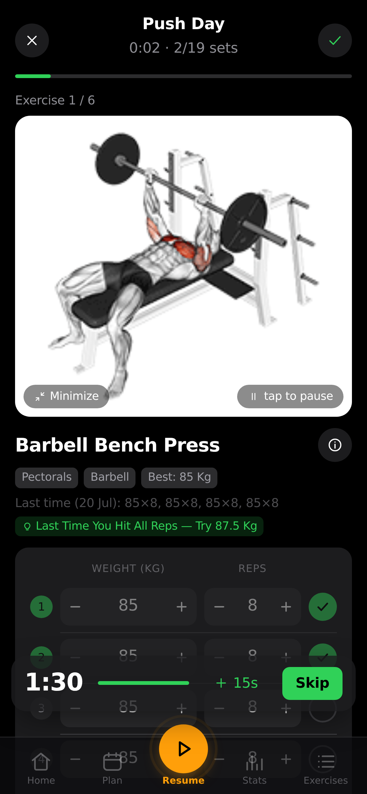

<div align="center">


<br>

**A self-hosted gym & body-weight tracker you actually own.**

Plan your week, run guided workouts, track every set and your body weight over time —
on your phone, synced across devices, behind your own passkey login.
No account on someone else's server, no subscription, no ads. Just `docker compose up`.

</div>

<br>

<div align="center">
<table>
<tr>
<td align="center"><br><sub><b>Home</b> — today's workout & weight</sub></td>
<td align="center"><br><sub><b>Guided workout</b> — animated demos & sets</sub></td>
<td align="center"><br><sub><b>Stats</b> — heatmap, charts & PRs</sub></td>
</tr>
</table>
</div>

<div align="center">

No signup, nothing to install — it runs entirely in your browser on example data.<br>
<sub>There's no server behind the demo, so passkey sign-in, sync across devices and the
admin dashboard only exist in a self-hosted instance.</sub>

</div>

## Why

Most workout apps lock your data behind a login on their servers, nag you to upgrade, or
disappear when the startup does. openGym is the opposite: **it runs on your box, your data
stays in a folder you control, and it's yours to fork.** It still feels modern — installable
as a home-screen app, passkey sign-in, offline support, sync across your phone and laptop.

## Features

- ⚖️ **Body-weight tracking** — interactive chart with a goal line you set, gains/losses colored by whether they move toward it
- 🏋️ **Weekly plan** — a routine per weekday, over a library of **1,324 exercises** (searchable, with animated demos)
- 🗓️ **Reschedule any day** — sick, missed a session, or fewer gym days this week? Move a workout to another day without touching your weekly plan
- ▶️ **Guided workouts** — it knows what day it is and starts today's session; asks your body weight first, pre-fills your weights from last time, rest timer, PR detection, per-exercise weight tracking
- ☀️ **The screen stays awake while you train** — no unlocking the phone and finding your place again between every set. On for as long as a workout is running, released the moment you finish it, and switchable off in Settings
- 🔗 **Supersets** — build them, and log them back-to-back with a rest only after the pair
- ⏱️ **Timed exercises** — planks, hangs, wall sits and loaded carries are logged by time, not reps, with a work timer that counts the set itself (separate from the rest timer) and logs the time you actually held. They can carry weight too
- 📈 **Progression that follows a rule** — pick one per routine, override it per exercise: linear, **Greyskull LP** (AMRAP top set, double jumps, 10 % resets), double progression through a rep range, or adding time. Your weights are already right when the session opens, and every target says *why* it's that number. Missed reps never advance the load, stalls trigger a deload, and bodyweight exercises progress in reps instead
- 💪 **Estimated 1RM** — per exercise, from your best eligible set (it names which one), with its own progress curve and a calculator for sets you haven't done. Won't guess above 12 reps
- 🎯 **Effort per set, in your scale** — an optional third column rating how hard a set was, as **RIR** (reps left in the tank) or **RPE** (the same judgement on a 10-point scale). Off by default; each set keeps the scale it was logged with, and nothing else reads the value — your progression and 1RM are unaffected
- 💪 **Bodyweight exercises, logged as bodyweight** — push-ups, pull-ups, dips and 300-odd others arrive knowing they carry no load, so there's no weight column and no working-weight prompt: one stepper, log the reps. Add a dip belt and it reads as an addition, and progression goes back to following the weight. Without one, reps climb — and past a ceiling you set, a set is added instead of a rep, up to the point where the honest advice is load or a harder variation
- ↔️ **Reps per side** — for lunges, single-arm rows and the rest. You log the total, the app shows the split ("8 per side"), and the target steps in twos so it never lands on a number one side can't have
- 🏃 **Cardio** — log time + speed, not just weight × reps
- 📤 **Share a plan** — send someone your routines and week schedule as a small file (no workouts, no weigh-ins), or print it as a clean PDF. Importing merges, so their plan is never overwritten
- 🔧 **Filter by equipment** — narrow the library to what you actually own; the options adapt to what you've picked, so every combination on screen has results behind it
- ✨ **Your own exercises** — a name and a body part is enough; they behave like built-in ones everywhere, with an optional description instead of an animation
- 🟩 **Activity heatmap** — a GitHub-style year view, shaded by time spent training
- 💪 **Muscle map** — a front-and-back body diagram shaded by how much work each muscle got, over a week, a month or all time. It names the muscles you *haven't* trained in that period, previews what a routine hits while you build it, and shows what you just trained when you finish. Male or female figure, your pick
- 🔔 **Push notifications** — rest-timer alerts even with the app closed, plus an optional reminder on days you have a workout planned but haven't logged one. Opt in per profile; keys are generated on first run, nothing to configure
- 🔑 **Passkeys, not passwords** — Face ID / Touch ID / fingerprint login; each profile keeps its own data, synced across devices
- 🛠️ **Admin dashboard** (optional) — for whoever runs the instance: who's training right now, per-user history, disable accounts, and invite-only signup. Off by default, so a fresh instance stays open with no admin
- 🎨 **Designed, not assembled** — light/dark themes and 8 accent colors saved to your profile, over a hand-drawn icon set instead of emoji, so it looks the same on every phone
- 🌍 **12 languages** — full UI translation (EN, DE, ES, FR, IT, PT, PL, TR, RU, ZH, KO, HI); exercise instructions localized in 10 of them, loaded on demand so the app stays fast
- 📥 **Bring your history with you** — import from **FitNotes** (Android and iOS), **Strong** and **Hevy**, or body weight straight out of an **Apple Health** export. Exercise names are matched against the library and anything unrecognised becomes one of your own exercises, so nothing in the file is dropped
- 📦 **Yours to keep** — one-tap JSON export/import, guest mode, **no telemetry**

## How it works

```
┌─────────────┐        ┌──────────────────────────────┐
│  Your phone │──HTTPS─▶│  web  (nginx)                │
│  / laptop   │        │   ├─ serves the built app    │
└─────────────┘        │   └─ proxies /api ──────────┐│
                       └──────────────────────────────┘│
                                                        ▼
                                        ┌──────────────────────────┐
                                        │  api  (Node + WebAuthn)  │
                                        │   └─ ./data (JSON files) │
                                        └──────────────────────────┘
```

- **frontend/** — React + Vite (React Router + Zustand), built to static files **inside Docker**
- **api/** — Node with no framework, one dependency (`@simplewebauthn/server`), storing everything as plain JSON files under `./data`
- **web/** — a multi-stage image that builds the frontend and serves it with nginx, proxying `/api` to the backend so it's all on **one origin** (passkeys require this)

## Your data

Lives in `./data` on your host: `db.json` (profiles + public passkeys), `state-<user>.json`
(each user's plan, workouts, body weight, settings), and `secret` (the session-cookie key).
**Back up `./data` and you've backed up everything.** Passkey private keys never touch the
server — they stay in your phone's secure hardware / your password manager.

## Contributing

Issues and PRs welcome — see [CONTRIBUTING.md](CONTRIBUTING.md). Good first issues: more starter
plans, exercise-data languages, import from other trackers. **A ⭐ helps more people find it.**

openGym is free and stays free: AGPL, no subscription, no paid tier, nothing held back for
sponsors. If it replaced a paid tracker for you and you want to chip in, the Sponsor button at the
top of the page is there — a star, a bug report or a PR is worth just as much.

## License

[GNU AGPL v3.0](LICENSE) — free and open source. You can self-host, use, modify and share it;
if you run a modified version as a network service, you must offer that version's source under
the same license. Nobody can turn openGym into a closed, proprietary product.

Exercise images/GIFs are fetched from the upstream dataset and keep their own terms — see [NOTICE.md](NOTICE.md).
